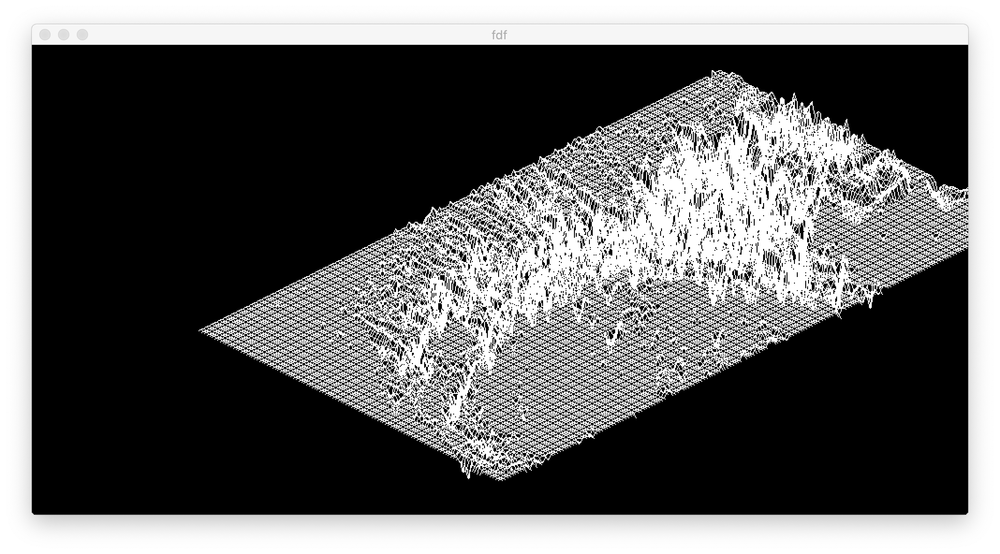
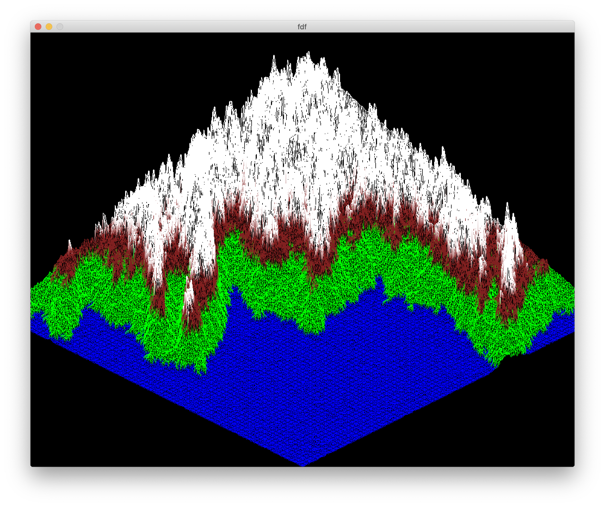

# FdF
3D Wireframe Viewer
<br>
This project is about creating a simplified 3D graphic representation of a given relief landscape.

### Examples




## Usage:

Go to `fdf` directory and:
```sh
$ make
$ ./fdf mars.fdf
```

## Resources:
* [Project's subject](./other/subject.pdf)
* https://github.com/VBrazhnik/FdF/wiki
* https://www.youtube.com/v/10P59aOgi68